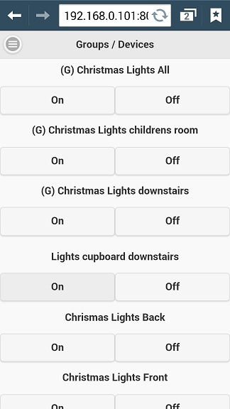

## Mini Automation Server (MAS)
### Overview
Mini Automation Server is a lightweight Python application for scheduling/controlling the lights and possible other electronics in your home. 

The application currently supports TellStick and TellStick Duo from [Telldus Technologies](http://www.telldus.se/). Tellstick is a USB transmitter that can control many different types of wireless electronics (lamps, actuators etc.). Other control devices might be added in future.

Mini Automation Server has following features:

* Schedule your devices to turn on or off at a specific time, sunset or sunrise
* Limit your scheduled devices to specific days of the week
* Restrict your devices to only turn on or off if sun is up or down
* Dimming support for devices that are dimmable
* Group your devices
* WEB user interface for turning on/off your groups or devices from a web browser or mobile device.
* WEB API for developing your own remote applications

All scheduling and configurations are made in a simple user editable text file called configuration file.

There exists many other home automation software's on the market (both open source and commercial), such as Switch King, NexaHome, HomeAutomation etc. However, for many users Mini Automation Server will have sufficient functionality for simple scheduling.

### Supported platforms
The application is written in Python and has been successfully tested with Python version 2.7 and 3.1.2.

Both Windows and Linux has been tested successfully. Mac OS X has not been tested, but should work as well. However, the init script provided to start the Mini Automation Server as a background process will (probably) only work for Debian based Linux platforms. 

The application has been successfully executed on a [Raspberry Pi](http://www.raspberrypi.org/) hardware using the [Rasbian OS](http://www.raspbian.org/) (based on Debian).

### Basic Installation
1. Install the telldus-core software and connect your Tellstick or Tellstick Duo. See the [Telldus web page](http://www.telldus.se/) for more information.
2. Configure your devices using the application provided by Telldus on Windows or by modify */etc/tellstick.conf* on Linux. See the [Telldus web page](http://www.telldus.se/) for more information.
3. Copy the scripts provided here to a folder of your choice. If you are running the software on a Raspberry Pi it is recommended to copy the files to the folder */home/pi/mas/*.

### Configuration
By default the configuration file loaded from the same folder as the main program, *mas.py*. The default name is *mas.config*. The file name and folder can be changed using the *-c* option when running the application. 

The devices are identified by the unique ID assigned in step 2 of "Basic Installation" above.

**Example 1:** Turn on device 2 at 17:00 and turn it off at 22:00 every day in week. 

    EVENT 17:00 on(2)
    EVENT 22:00 off(2)

**Example 2:** Turn on device 3 at 11:00 only on Mondays and Fridays. 

    EVENT 11:00 Mon/Fri on(3)

**Example 3:** Dim device 4 to ~33% at 18:00, ~66% at 20:00 and 100% at 22:00

    EVENT 18:00 dim (4, 84)    
    EVENT 20:00 dim (4, 168)
    EVENT 22:00 dim (4, 255)    
    
**Example 4:** Turn on device 5 at sunset and turn it off at sunrise

    EVENT Sunset on(5)
    EVENT Sunrise off(5)

**Example 5:** Turn on device 6 at one hour after sunset and turn it off 30 minutes before sunrise

    EVENT Sunset+1 on(6)
    EVENT Sunrise-0.5 off(6)
    
**Example 6:** Turn on device 7 at 07:00 but only if the sun is down. Turn it off at sunrise.

    EVENT 07:00 Sundown on(7)
    EVENT Sunrise off(7)

**Example 7:** Turn on devices 1, 3 and 5 as a group at 07:00

    GROUP G1 "Outside_lamps" 1 3 5
    EVENT 07:00 on(G1)
    
Using the Sunset, Sunrise, Sunup or Sundown requires latitude and longitude to be set (LAT_LONG command)
    
See the comments in *mas.config* for the complete syntax.    
    
### Running
The application is started by executing the *mas.py* Python script:

    $ chmod +x mas.py
	$ ./mas.py
    Running Mini Automation Server 1.0.0
    Use Ctrl-C to quit.

The application will run until Ctrl + C are stroked on the keyboard. Execute *python mas.py -?* for options.

### Enabling the WEB interface and API
You may optionally start the WEB interface (using HTML and JavaScript) and export the WEB API. 

	$ ./mas.py -w <ip-address> -p <port>
	
Port 8080 is used by default if the -p option is omitted. The startup script, mas.sh, will start the WEB interface/API by default.

### Start as a Service
An init.d script is provided for Debian based platforms, such as [Rasbian OS](http://www.raspbian.org/) for [Raspberry Pi](http://www.raspberrypi.org/). Following instruction assumes that the scripts are copied to */home/pi/mas/*. If a different folder is used, please change the *DIR* variable in *mas.sh*.

    $ cd /home/pi/mas
    $ chmod +x mas.py
    $ sudo cp init-scripts/linux_debian/mas.sh /etc/init.d/
    $ cd /etc/init.d/
    $ sudo chmod +x mas.sh
    $ sudo update-rc.d mas.sh defaults

Now reboot the system. Check that the application is running.

    $ /etc/init.d/mas.sh status
    [ ok ] /home/pi/mas/mas.py is running.

If the configuration file is updated, restart the application by rebooting the system or execute:

    $ sudo /etc/init.d/mas.sh restart
    [ ok ] Stopping system mas daemon:.
    [FAIL] /home/pi/mas/mas.py is not running ... failed!
    [ ok ] Starting system mas daemon:.

    
### Author and license
This application is written by Joel Eriksson and is licensed under the GNU Public License.

### Version history
**1.2.0** (December 13, 2014)

* Added support for WEB interface and WEB API 

**1.1.0** (Mars 16, 2014)

* Added support for time offset on Sunset and Sunrise 

**1.0.0** (Mars 7, 2014)

* First release